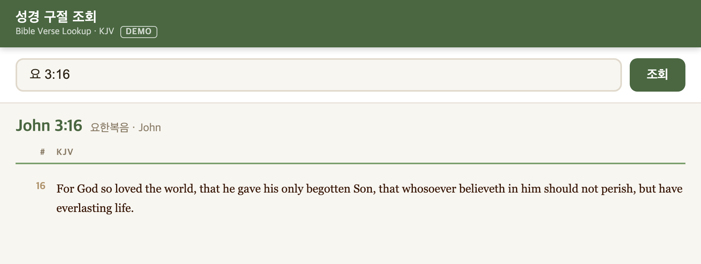

# Bible Verse Lookup (성경 구절 조회)

A single-page tool for looking up Bible verses side by side in Korean and English.

Built for church interpreters who need to find and display verses in real time during live sermons. Currently used at my church.



**Live demo:** _coming soon (GitHub Pages)_

## Features

- Look up verses using Korean or English book names and abbreviations: `요 3:16`, `John 3:16`, `Jn 3:16`, `롬 8:28`
- Whole chapters (`시 23`) and verse ranges (`Ps 23:1-6`)
- Korean and English text in parallel columns, stacked on narrow screens
- One HTML file with no server, build step or network access needed
- Ships with the full public-domain KJV, and you can plug in your own licensed translations

## Quick start

```sh
git clone <this repo>
cd <repo>
git config core.hooksPath .githooks   # enable the copyright-safety pre-commit hook
open index.html
```

The repo includes only the public-domain **King James Version**, in [data/sample/kjv.js](data/sample/kjv.js). The demo therefore shows a single English column and a **DEMO** badge in the header.

## Design decisions

### Loading data with a `<script>` tag instead of `fetch()`

Interpreters often open the page straight from disk, so it has to work over `file://`. Browsers block `fetch()` of local files from a `file://` page, but they allow `<script src>`. Each data file therefore sets `window.BIBLE_DATA`, and the page loads it with a script tag, so the page still runs without a server.

### Separating the app from the Bible text

The first version embedded all of the text in the HTML, as one 8.6MB line. That made the code hard to share, because the translations we use are copyrighted. The page now tries `data/bible_data.js` (local and gitignored) first, then falls back to the bundled KJV. Both files use the same schema, so the app code doesn't care which one it got.

### A pre-commit hook that blocks copyrighted text

A `.gitignore` alone isn't enough, because renaming a file or copying text into a new file gets around it. The hook checks every staged file in three ways:

- it blocks known local data file names
- it blocks signature phrases that appear in the NKJV and the Korean translations but not in the KJV
- it blocks any file over 1MB outside `data/sample/`

I ran it against the full KJV to confirm it raises no false positives, and against renamed copies of the real data to confirm it catches them.

## Using your own translations (Korean/English parallel)

Most modern translations are under copyright, including the NKJV, 개역개정 and 개역한글, so this repo does not include them.
If you are licensed to use a translation, generate a local data file from it:

```sh
# A combined JSON file in the app schema:
#   [{a, en, ko, c: [[ko_verses[], en_verses[]], ...]}, ...]
python3 scripts/build_data.py --combined bible_data.json

# Or one JSON file per translation:
#   [{abbrev, chapters: [[verse, ...], ...]}, ...]
python3 scripts/build_data.py --ko ko.json --en en.json --ko-name 개역한글 --en-name NKJV
```

This writes `data/bible_data.js`. `index.html` loads it automatically when it exists, and falls back to the KJV demo otherwise.
**`data/bible_data.js` is gitignored and must never be committed.**

Book abbreviations (`gn`, `ex`, ... `re`) are listed in [scripts/books.py](scripts/books.py).

You can also run the copyright check on any files directly:

```sh
scripts/check_no_copyrighted.sh path/to/file ...
```

### Project layout

```
index.html                        the app (no Bible text embedded)
data/bible_data.js                your local data (gitignored)
data/sample/kjv.js                public-domain KJV
data/sample/SOURCE.md             KJV source and license
scripts/build_data.py             your JSON -> data/bible_data.js
scripts/build_sample.py           eBible.org KJV -> data/sample/kjv.js
scripts/check_no_copyrighted.sh   blocks copyrighted Bible text from commits
.githooks/pre-commit              runs the check above before each commit
docs/screenshot.png               README screenshot
```

## Roadmap

- **Real-time sermon verse detection:** use speech-to-text to pick up verse references as the preacher says them, and show those verses automatically.
- **Backend API:** serve verse lookups from an API, so other tools such as slide software and the detection service can use the same data.

## License

The code is under the [MIT License](LICENSE). The KJV text is in the public domain; see [data/sample/SOURCE.md](data/sample/SOURCE.md).
