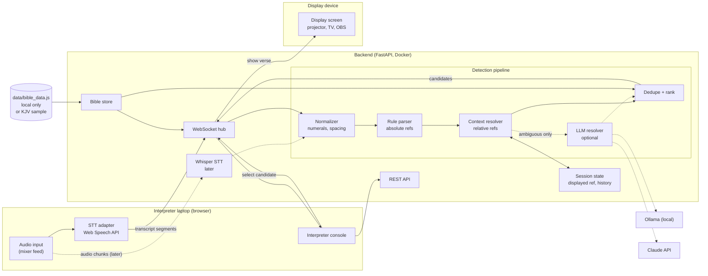
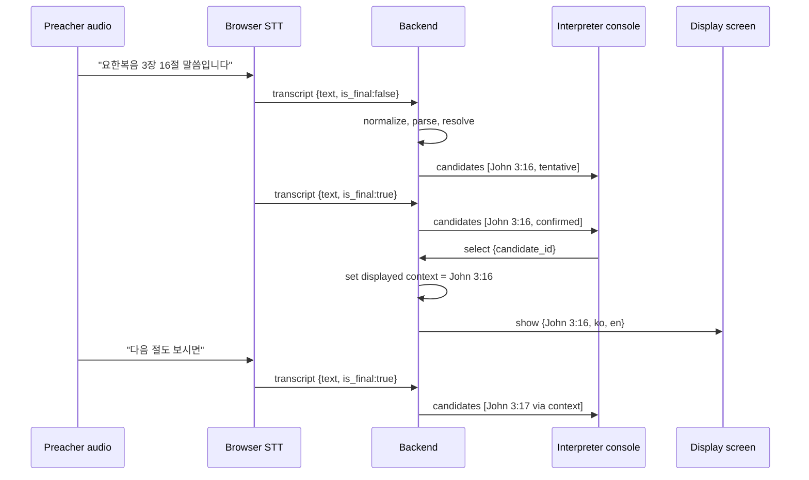

# LiveVerse Realtime: Design

Status: draft for review (stage 0)
Date: 2026-10-02

## 1. Goal

Help church interpreters during live sermons. The system listens to the sermon, notices when the preacher mentions a Bible reference, and shows it to the interpreter as a candidate. The interpreter clicks a candidate, and the verse text (NKJV / 개역한글) appears on a display screen.

### Principles already decided

1. **Rule-based detection first.** A deterministic parser handles absolute references ("요한복음 3장 16절") and relative ones ("다음 절", "17절"). For relative references, it uses the last displayed verse as context. An LLM is optional, sits behind its own interface, and can be swapped between a local model (Ollama) and the Claude API. The whole system must work with no LLM configured.
2. **Nothing is displayed automatically.** The system only suggests. The interpreter confirms each candidate with a click.
3. **Speech recognition is swappable.** The first version uses the browser Web Speech API. Later, server-side Whisper can replace it without changing the parser or the UI.
4. **Backend is Python FastAPI** with REST and WebSocket endpoints, packaged with Docker.
5. **The static demo stays as it is.** `index.html` keeps working on its own. New work lives in a separate folder (`realtime/`) on a separate branch.
6. **Copyrighted text stays local.** NKJV and 개역한글 data are never committed or baked into images. The public demo uses the KJV.

### Non-goals (for now)

- Machine translation of the sermon
- Automatic display without a human in the loop
- Multi-church hosting or user accounts

## 2. Architecture



Dotted lines are optional or later-stage paths.

### Sequence: from speech to display



## 3. Components

### 3.1 Audio input and STT adapter

- The STT adapter turns audio into text segments: `{text, is_final, lang, t_client}`.
- **Stage 3 implementation: browser Web Speech API.**
  - It runs in Chrome on the interpreter laptop with `lang="ko-KR"` and interim results enabled, and auto-restarts when the browser ends recognition.
  - It sends both interim and final segments to the backend over the WebSocket.
- **Later: server-side Whisper.**
  - The browser streams audio chunks instead of text, and the backend runs `faster-whisper` with voice activity detection.
  - Its output enters the pipeline at the same point (the normalizer). The parser, console and display do not change.
- The interface on the backend:

  ```python
  class SpeechSource(Protocol):
      async def segments(self) -> AsyncIterator[TranscriptSegment]: ...
  ```

  `BrowserTranscriptSource` wraps the WebSocket messages, and `WhisperSource` wraps audio chunks.

### 3.2 Normalizer

Turns raw transcript text into a form the parser can rely on.

- Converts Sino-Korean numerals to digits: `삼` 3, `십육` 16, `백십구` 119, `이십삼` 23.
- Converts English number words: `sixteen` 16, `one hundred nineteen` 119, `twenty third` 23.
- Unifies separators: `：`, ` : `, and spoken "colon" become `:`. `~`, `～`, `부터 ... 까지`, `through` and `to` become a range marker.
- Collapses spacing variants: `3 장` and `3장`, `요한 복음` and `요한복음`.
- Keeps a character offset map back to the original text, so the console can highlight what was matched.

### 3.3 Rule parser (absolute references)

- Finds book + chapter (+ verse, + range) mentions inside a longer segment, not only whole-string input like the current `parseRef()`.
- Book aliases come from one table generated from `scripts/books.py`, which keeps the static demo and the backend in sync.
- **Speech mode turns off single-syllable abbreviations** (`요`, `창`, `마`, `막`). They are common in typed input but collide with ordinary speech, for example the sentence ending "...했어요 3". Typed lookups in the console keep them.
- Each result carries `matched_text`, `span`, `kind` (`absolute`), and a confidence score. The score is raised by trigger words nearby ("말씀", "읽겠습니다", "보시면", "let's read", "turn to") and lowered by missing verse numbers or by book names that double as person names ("요한", "마가", "누가" without "복음").

### 3.4 Context resolver (relative references)

- Session context is the **last displayed** reference, which the interpreter set by clicking. It is not the last detected candidate.
- Resolves:
  - verse only: "17절" means verse 17 in the context book and chapter
  - next and previous: "다음 절", "앞 절"
  - next chapter: "다음 장"
  - the same chapter: "같은 장 20절"
  - going back: "다시 16절로"
- Bounds are checked against the Bible store. "Next verse" after the last verse of a chapter goes to verse 1 of the next chapter, at lower confidence.
- If there is no context yet, a relative mention produces no candidate. The miss is logged for evaluation.

### 3.5 LLM resolver (optional, stage 5)

```python
class RefResolver(Protocol):
    async def resolve(
        self, segment: str, context: Context, rule_candidates: list[Candidate]
    ) -> list[Candidate]: ...
```

- **Implementations:**
  - `NullResolver` is the default and returns nothing.
  - `OllamaResolver` uses a local model.
  - `ClaudeResolver` uses the Claude API, for example `claude-haiku-4-5-20251001` for low latency.
- **When it is called:**
  - only for segments that contain trigger words but where the rules found nothing or found conflicting results
  - never on every segment
- **Limits:**
  - It runs asynchronously, with a timeout of about 1.5 s.
  - Its candidates arrive later and are labeled `source: llm`.
  - Rule candidates are never delayed by it.
- **Output checks:**
  - The LLM returns structured references only, never verse text.
  - Every reference is validated against the Bible store, and invalid ones are dropped.
- **Configuration:** chosen with `LLM_PROVIDER=none|ollama|claude`.

### 3.6 Dedupe and ranking

- Merges the same reference seen in interim and final segments under one stable candidate ID.
- Suppresses repeats of the same reference within a short window (default 30 s) unless the interpreter cleared it.
- Keeps the last 5 candidates, newest first. Displayed candidates are marked.

### 3.7 Session state

- One session per service. It holds:
  - the displayed reference (the context)
  - the candidate list
  - a history of what was displayed
  - the connected clients by role (`console`, `display`)
- It lives in memory. A restart starts a new session, which is acceptable for a two-hour service.

### 3.8 Bible store

- Loads `data/bible_data.js`, the same file the static demo uses, by stripping the `window.BIBLE_DATA =` wrapper. If that file is missing, it falls back to `data/sample/kjv.js`.
- The path comes from `BIBLE_DATA_PATH`. In Docker, `data/` is mounted read-only, so text is never copied into an image.
- It provides lookups by reference and the verse and chapter counts for bounds checks.

### 3.9 Interpreter console (browser)

- Shows the live transcript (small, scrolling) with matched text highlighted.
- Shows the candidate list with the reference, a one-line preview, a source tag (`rule`, `context`, `llm`) and a confidence indicator.
- **One click or one key displays a candidate.** Keys `1` to `5` pick a candidate, `N` shows the next verse, and `Esc` clears the display. Interpreters are speaking the whole time, so selection must take almost no attention.
- Includes a manual search box that reuses the typed parser, as a fallback.

### 3.10 Display screen (browser)

- A full-screen page that only listens for `show` and `clear`.
- Layout options: Korean + English, English only, or Korean only, with large type.
- Works as an OBS browser source too, if the church streams.

### 3.11 Protocol

WebSocket `/ws?role=console|display&session=<id>&pin=<pin>`

| Direction | Type | Payload |
|---|---|---|
| console to server | `transcript` | `seq, text, is_final, lang, t_client` |
| console to server | `select` | `candidate_id` |
| console to server | `display_ref` | `ref` (from manual search or "next verse") |
| console to server | `clear` | none |
| server to console | `candidates` | `items[{id, ref, label, source, confidence, matched_text, preview}]`, `t_server` |
| server to console | `context` | `displayed_ref` |
| server to display | `show` | `ref, label, verses[{num, ko, en}], names` |
| server to display | `clear` | none |

REST

| Method | Path | Purpose |
|---|---|---|
| GET | `/api/health` | liveness, which data set is loaded |
| GET | `/api/verses?ref=John+3:16-18` | verse lookup |
| POST | `/api/parse` | debug: run the pipeline on a text and context |
| POST | `/api/sessions` | start a session, returns id and PIN |
| GET | `/api/sessions/{id}` | current state |
| GET | `/api/metrics/latency` | latency summary for the session |

## 4. Folder structure

The new work goes on a feature branch, `feature/realtime`. Existing files stay where they are.

```
index.html                     static demo (unchanged)
data/                          local data (gitignored) + data/sample/kjv.js
scripts/                       existing build and copyright scripts
docs/
  realtime-design.md           this document
realtime/
  README.md
  docker-compose.yml
  backend/
    pyproject.toml
    Dockerfile
    .dockerignore              excludes data/ and local files
    app/
      main.py                  FastAPI app
      api/rest.py
      api/ws.py
      core/session.py
      core/bible_store.py
      core/models.py           Reference, Candidate, Context, Segment
      detect/normalize.py
      detect/numerals.py
      detect/books.py          generated alias table
      detect/parser.py         absolute references
      detect/context.py        relative references
      detect/pipeline.py
      llm/base.py              RefResolver protocol
      llm/null.py
      llm/ollama.py
      llm/claude.py
      stt/base.py              SpeechSource protocol
      stt/browser.py
      stt/whisper.py           later
      metrics/latency.py
    tests/
      fixtures/parser_cases.jsonl
      test_numerals.py
      test_parser.py
      test_context.py
      test_pipeline.py
      test_ws.py
    eval/
      run_eval.py
      corpus/                  gitignored: recordings, transcripts, labels
  frontend/
    console/index.html, console.js
    display/index.html, display.js
    shared/ws.js, speech.js
.github/workflows/ci.yml
```

`.gitignore` needs a fix in stage 1. Patterns like `*.json` and `*.txt` currently match at any depth, so files such as `tsconfig.json` would be ignored silently. They should be anchored to the repo root (`/*.json`, `/*.txt`). The `data/*` whitelist stays.

## 5. Reference expressions the parser must handle

### 5.1 Korean

| Category | Examples | Expected |
|---|---|---|
| Full book name, chapter, verse | 요한복음 3장 16절 | John 3:16 |
| Sino-Korean numerals | 요한복음 삼 장 십육 절 | John 3:16 |
| Large numerals | 시편 백십구 편 백오 절 | Psalms 119:105 |
| No spaces | 요한복음3장16절 | John 3:16 |
| Colon form | 요한복음 3:16 | John 3:16 |
| Psalms use 편 | 시편 23편, 시편 23편 1절 | Psalms 23, Psalms 23:1 |
| Chapter only | 로마서 8장 | Romans 8 |
| Range with 부터/까지 | 3장 16절부터 18절까지 | :16 to 18 |
| Range with 에서 | 16절에서 18절 | :16 to 18 |
| Compact range | 16~18절, 16 내지 18절 | :16 to 18 |
| List | 1절과 3절, 16, 17절 | separate candidates |
| "and following" | 16절 이하 | :16, open range, show 16 first |
| Numbered books | 고린도전서, 고린도 전서, 고전 (typed only) | 1 Corinthians |
| Numbered epistles | 요한일서, 요한 1서, 요한 일서 | 1 John |
| Ordinal "first" | 첫 절, 첫째 절 | verse 1 |
| Last verse | 마지막 절 | last verse of chapter (from store) |
| Verse only (relative) | 17절, 17절 말씀 | context book and chapter :17 |
| Next / previous | 다음 절, 그 다음 절, 이어서, 앞 절 | context ±1 |
| Next chapter | 다음 장, 4장으로 넘어가서 | context chapter + 1 / 4 |
| Same chapter | 같은 장 20절, 같은 장 뒷부분 20절 | context chapter :20 |
| Return | 다시 16절로 | context chapter :16 |
| Particles attached | 요한복음을, 로마서에서, 3장에 | strip particles |
| Trigger phrases | 말씀입니다, 읽겠습니다, 함께 보시면, 찾아보시면 | raise confidence |
| Person names | 요한이, 마가가, 누가 (who) | no book unless 복음 or a chapter follows |
| Non-Bible numbers | 3장짜리 편지, 2절기 | rejected (no book, no context) |

### 5.2 English

| Category | Examples | Expected |
|---|---|---|
| Standard | John 3:16, John 3 16 | John 3:16 |
| Spoken | John three sixteen | John 3:16 |
| Explicit words | John chapter three verse sixteen | John 3:16 |
| Large numbers | Psalm one hundred nineteen verse one hundred five | Psalms 119:105 |
| Ordinal Psalm | the twenty third Psalm | Psalms 23 |
| Possessive form | the third chapter of John | John 3 |
| Numbered books | First Corinthians 13, 1 Corinthians 13 | 1 Corinthians 13 |
| First John vs John 1 | First John 1 9 vs John 1 9 | 1 John 1:9 vs John 1:9 |
| Ranges | verses 16 through 18, 16 to 18 | :16 to 18 |
| Verse only | verse 17 | context :17 |
| Next / previous | next verse, the following verse, previous verse | context ±1 |
| Return | back to verse 5 | context :5 |
| Triggers | let's read, turn with me to, it says in | raise confidence |
| Person names | John said, Mark wrote | no book unless a number follows |

These rows become fixtures in `tests/fixtures/parser_cases.jsonl`, one JSON object per case: `{input, lang, context, expected}`.

## 6. Latency targets and measurement

| Hop | Target (p95) | Notes |
|---|---|---|
| Final transcript received to candidates sent (rules) | 50 ms | parser alone should be under 5 ms per segment |
| Candidates sent to rendered in console | 100 ms | LAN WebSocket + DOM |
| Speech end to candidate visible (rules, end to end) | 1.5 s | dominated by STT finalization; interim results may show earlier |
| Click to verse on display screen | 200 ms | same LAN |
| LLM candidate (when enabled) | 2.5 s after final transcript | never blocks rule candidates |

**How it is measured**

- Every message carries timestamps:
  - `t_client` when STT emits a segment
  - `t_recv` and `t_sent` on the server
  - `t_render` reported back by the console and the display
- Clock offset between each browser and the server is estimated at connect time (NTP style ping, 5 samples, median).
- The server writes one JSONL line per hop to `realtime/backend/logs/latency.jsonl`, which is gitignored. `GET /api/metrics/latency` returns p50, p95 and max per hop.
- **Replay test:**
  - A recorded sermon segment, with the speaker's consent and kept locally, is played through the audio input.
  - The script compares labeled mention timestamps with the time each candidate appeared.
  - It gives an end to end number that includes the STT.

## 7. Test strategy

### 7.1 Unit tests (pytest)

- `test_numerals.py`: Sino-Korean and English number words from 1 to 200, both directions, as a property test (Hypothesis).
- `test_parser.py`: table-driven from `parser_cases.jsonl`. It covers every row in section 5, plus negative cases that must produce nothing.
- `test_context.py`: relative references with and without context, chapter boundaries, last verse, missing context.
- `test_pipeline.py`: interim then final segments, dedupe, ranking, trigger word confidence.
- The same fixture file runs against the typed parser in the static demo. A small Node script imports the cases, so the two parsers do not drift on typed input.

### 7.2 Integration tests

- FastAPI `TestClient` WebSocket tests with a fake speech source that replays scripted transcripts.
- Checks that a `select` produces a `show` on every connected display and updates the context.
- Runs with the KJV sample only, so CI never needs copyrighted data.

### 7.3 Accuracy evaluation

- **Corpus:**
  - Recorded sermons from a participating church, used with permission and stored only in `eval/corpus/` (gitignored).
  - Each mention is labeled with timestamp, spoken text and the intended reference.
- **Running in two modes:**
  - Ground truth transcript, to measure the parser alone.
  - STT transcript, to measure the whole pipeline.
  - The difference between the two shows how much error comes from speech recognition.
- **Metrics:**
  - detection precision, recall and F1 at the reference level
  - top 1 and top 3 candidate accuracy
  - relative reference resolution accuracy
  - false positives per hour of sermon
- **Comparisons:** rules only, then rules + Ollama, then rules + Claude, all on the same corpus. The LLM is enabled only if it raises recall without raising false positives per hour beyond an agreed limit.
- **Output:** `eval/run_eval.py` writes a Markdown report. The report includes counts and metrics only, never transcript text.

### 7.4 CI checks

- `scripts/check_no_copyrighted.sh` on all tracked files
- `pytest` with coverage
- `ruff`
- the Node fixture check
- `docker build` of the backend

## 8. Paid services and free alternatives

| Area | Free option | Paid option | Notes |
|---|---|---|---|
| Speech to text (stage 3) | Web Speech API in Chrome | none needed | Free, but Chrome sends audio to Google, so it needs internet. Safari support varies. |
| Speech to text (later) | `faster-whisper` on local hardware | OpenAI Whisper API, Deepgram, Google Cloud STT (per minute) | Local Whisper needs a reasonably fast machine (Apple Silicon or a GPU) for low latency in Korean. |
| LLM resolver | none (rules only), Ollama with a local model | Claude API (per token) | Optional. Claude gives better quality with no hardware but sends transcript text off site. |
| Bible text for display | KJV (public domain) | NKJV, 개역한글 / 개역개정 licensing for projection | The church should confirm permission terms with HarperCollins (NKJV) and 대한성서공회 for on-screen use. |
| Hosting | interpreter laptop or a church PC on the LAN | cloud VM | A local LAN setup avoids cost and works without internet, except for Web Speech. |
| HTTPS for microphone access | `localhost`, or `mkcert` on the LAN | public domain + certificate | Browsers allow microphone and speech APIs only in a secure context. |
| CI | GitHub Actions (free for public repos) | none needed | |
| Display | existing projector or TV + any browser, OBS browser source | none needed | |

## 9. Stages and completion criteria

| Stage | Work | Done when |
|---|---|---|
| 0. Design | This document | Reviewed and approved. Committed on `feature/realtime` together with the CLAUDE.md rule. |
| 1. Reference parser + tests | Numerals, normalizer, book aliases from `scripts/books.py`, absolute parser, context resolver, `.gitignore` anchoring fix | Every case from section 5 is in fixtures and passes. Numeral property test passes for 1 to 200. Parser module coverage is at least 90 percent. Parsing takes under 5 ms per segment. No web or STT code yet. |
| 2. Backend API + Docker | FastAPI app, REST and WebSocket protocol from 3.11, session state, Bible store, `docker-compose.yml` | `docker compose up` serves `/api/health` and `/api/verses` with the KJV. WebSocket integration tests pass. The image contains no Bible text, and data is mounted read only. |
| 3. Speech input | `speech.js` (Web Speech API, ko-KR, interim results, auto restart), transcript messages, latency timestamps, reconnect | Speaking a reference into the laptop mic produces a candidate on the server log in Chrome on `localhost`. Latency JSONL is written. A dropped WebSocket reconnects without a page reload. |
| 4. Console + display | Interpreter console (transcript, candidates, keys 1 to 5, N, Esc, manual search) and the display screen | During a rehearsal with real audio, the interpreter can display candidates by click and by key. Click to display is under 200 ms p95 on the church LAN. The display works full screen and as an OBS source. |
| 5. Optional LLM | `RefResolver` interface, Null, Ollama and Claude implementations, ambiguity trigger, timeout, validation | With `LLM_PROVIDER=none`, behavior is identical to stage 4. With a provider set, LLM candidates appear labeled and never delay rule candidates. The evaluation shows the recall gain and the false positive rate. |
| 6. Measurement, CI, docs | Latency report, accuracy report, `.github/workflows/ci.yml`, README update | CI runs all checks from 7.4 on every push. Reports exist for one full recorded sermon. The README describes the realtime mode, setup and data rules, and the static demo is still linked and working. |

## 10. Open decisions

**Church environment**

1. Is internet available and reliable in the sanctuary? Web Speech needs it, while local Whisper does not.
2. What audio source can we get? Options are a feed from the mixing console, or a microphone. A room or booth microphone will also pick up the interpreter's own voice, which would confuse detection. A mixer feed is strongly preferred.
3. What language is the sermon in: Korean only, English only, or sometimes both?
4. Who reads the display screen: the English speaking congregation (NKJV only), or everyone (both translations)?

**Devices**

5. What does the interpreter use? Is it a Mac laptop, and which browser?
6. What drives the display: a separate PC, a TV with a browser, or OBS for the livestream?
7. Where does the backend run: on the interpreter laptop, or on a separate always-on machine? For local Whisper or Ollama, which hardware is available?

**Policy**

8. Does the church have, or need, permission to project NKJV and 개역한글 text?
9. Is it acceptable to send sermon audio to Google (Web Speech) and transcript text to Anthropic (Claude API)? If not, use local Whisper and Ollama only.
10. May we record sermons for the evaluation corpus? Who gives consent, and how long are recordings kept?
11. Should transcripts and logs be deleted after each service?

**Product**

12. How many interpreters and display screens will run at the same time?
13. Is a simple session PIN on the LAN enough, or is more access control needed?
14. Should the display wait for a click every time, or should the console offer a "follow mode" for "next verse" within an already displayed passage? This is still a click, but a single key.
15. What is the acceptable false positive rate per hour? It sets the LLM acceptance threshold.
16. Branch and release: when should `feature/realtime` merge to `main`, and should the realtime app also get a public KJV demo on GitHub Pages? Pages cannot host the backend.
