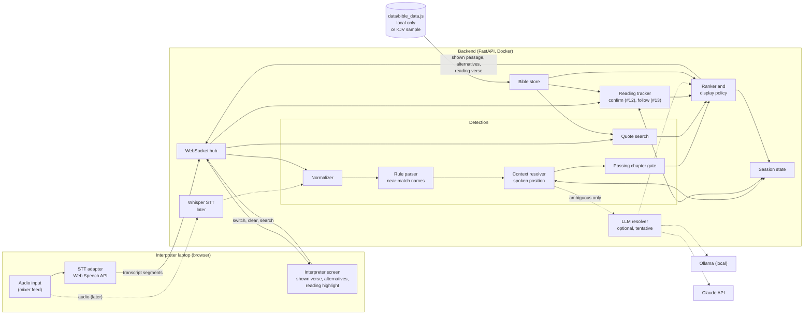
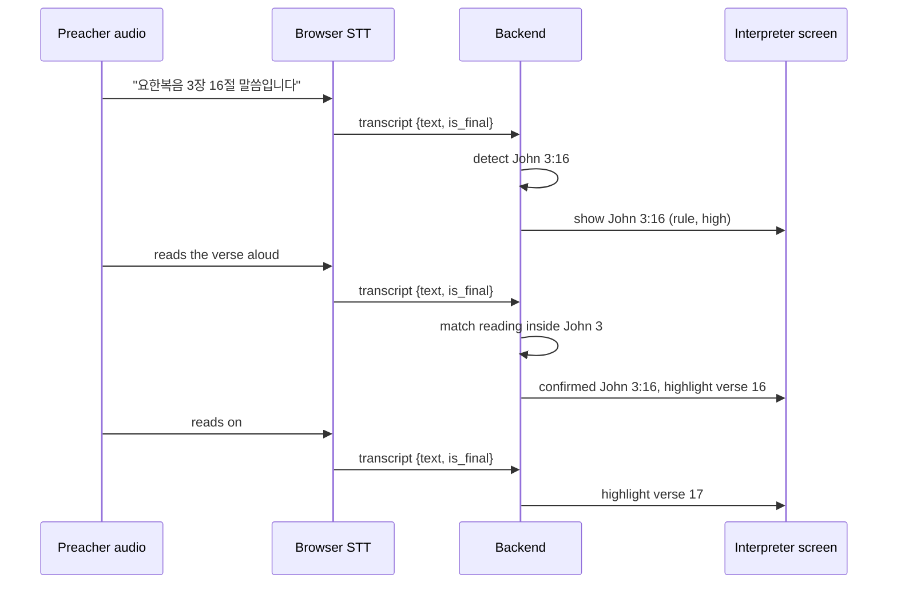

# LiveVerse Realtime: Design

Status: v2, 2026-10-03

Changes from v1:
- There is one screen, the interpreter's own. Nothing is projected.
- The most likely verse is shown right away, without a click.
- An LLM can guess ambiguous mentions, and its guess is shown as tentative.
- New: confirming the verse from what the preacher reads aloud (#12), and following the reading verse by verse (#13).

## 1. Goal

Help a church interpreter during live sermons. The interpreter reads the NKJV on their own screen while interpreting into English. The system listens to the sermon and puts the passage the preacher is talking about on that screen. When the preacher reads the passage aloud, the screen follows along.

### Principles

1. **Rule-based detection first.**
   - A deterministic parser handles absolute references ("요한복음 3장 16절") and relative ones ("다음 절", "17절").
   - The whole system works without an LLM.
2. **Show the best guess right away.**
   - The most likely candidate appears on the screen as soon as it is detected, without waiting for a click.
   - Other candidates are listed small beside it, and one key switches to any of them.
   - Every shown passage carries its confidence and where it came from.
3. **Ambiguous mentions may get an LLM guess, marked as tentative.**
   - The LLM sits behind an interface that can use a local model (Ollama) or the Claude API.
   - A tentative guess is replaced as soon as rules or the reading confirm something.
4. **The reading is the strongest evidence.**
   - When the preacher starts reading, the words are matched against the Bible text to confirm, correct or fill in the shown verse (#12).
   - While the reading goes on, the screen highlights the verse being read (#13).
5. **Speech recognition is swappable.** The first version uses the browser Web Speech API. Server-side Whisper can replace it later.
6. **Backend is Python FastAPI** with REST and WebSocket endpoints, packaged with Docker.
7. **The static demo stays as it is.** New work lives in `realtime/` on the `feature/realtime` branch.
8. **Copyrighted text stays local.** NKJV and 개역한글 are loaded at run time from the local `data/` folder. They are never committed or put in images. The public demo uses the KJV.

### Non-goals

- Projecting or streaming verses to the congregation
- Machine translation of the sermon
- Multi-church hosting or user accounts

## 2. Architecture



Dotted lines are optional or later-stage paths.

### Sequence: from speech to the screen



## 3. Components

### 3.1 Audio input and STT adapter

- The adapter turns audio into text segments: `{text, is_final, lang, t_client}`.
- **Stage 3: browser Web Speech API.** Chrome on the interpreter laptop, `lang="ko-KR"`, interim results on, automatic restart. Segments go to the backend over the WebSocket.
- **Whisper streaming worker (experiment).** A separate process on the same Mac (`realtime/backend/stt_worker`) reads the audio input, cuts it into utterances with Silero VAD, decodes each with mlx-whisper and the book name prompt, and sends interim and final segments to `/ws` like the browser does. Nothing in the server or the screen changes.
  - Why a host process and not the backend: the backend runs in Docker, and a container on macOS cannot use the Metal GPU that mlx needs. Reading the input device on the host also avoids streaming audio from the browser.
  - Interims: the utterance so far is decoded every 1 s. Finals: when 0.4 s of silence ends the utterance, or at 12 s (cut at the quietest frame).
  - One mlx-whisper call (large-v3-turbo) took 0.65 to 0.8 s for 1 to 12 s of audio on an M3 Pro, so decoding keeps up with 1 s interims.
- Evaluation on recorded sermons showed that a prompt with Bible book names, applied to every 30 s window, removes most misheard book names (see `realtime/backend/eval`). Web Speech has no such prompt, which is why near-match book names (3.3) matter.

```python
class SpeechSource(Protocol):
    async def segments(self) -> AsyncIterator[TranscriptSegment]: ...
```

### 3.2 Normalizer

- Sino-Korean and English number words become digits.
- Range and colon characters are unified.
- "10편 N편" (a common mishearing of 시편) becomes 시편 N편.
- An offset map leads back to the original text, so the screen can show what was matched.

### 3.3 Rule parser

- Finds book + chapter (+ verse, + range) mentions inside a segment.
- **Book names:**
  - Korean names must start a word, and they may contain spaces only at known joins (요한 복음, 고린도 전서, 요한 일 서). This stops matches like 나오미가 → 미가.
  - Short forms (요, 시, 요일, 고전) are accepted in typed search only.
- **Near-match names:** an unknown word right before a chapter number is compared with the 66 book names by jamo edit distance.
  - Close matches are accepted.
  - Looser matches are accepted only for a book already shown in this service.
  - A word that looks like a book name but cannot be confirmed blocks the old context, so its chapter is not read as a chapter of the previous book. The same holds for a near match whose chapter or verse does not exist in that book.
- **Numbers out of range:** a book said clearly with a chapter or verse it does not have ("로마서 17장"; Romans has 16 chapters).
  - Nothing is shown, and the screen does not change.
  - The numbers are never attached to the previous book. Before this rule, "로마서 17장 1절" after John showed John 17:1.
  - The spoken position moves to that book with no chapter (see 3.4).
  - STT may have added a digit ("7장" heard as "17장"). If dropping the first digit of the out of range number gives a real passage (Romans 7:1), it is offered as a low confidence alternative marked `guess`. It is never shown by itself; the interpreter can pick it in one click.
- **Ranges:** verses said in a row become one range ("19절 20절", "1절 5절까지").

### 3.4 Context: two kinds

- **Spoken position:** the last reference the preacher said, including chapters said in passing. Relative mentions ("2절", "다음 절") are resolved against it.
- **Book only:** after a book said with an out of range chapter, the spoken position is that book with no chapter. A later "3장" resolves to that book's chapter 3. Verse level mentions ("2절", "다음 절") have no chapter to attach to and produce nothing until a chapter is said.
- **Shown passage:** what is on the interpreter's screen now. It is used to hide a chapter said again while one of its verses is shown, and to allow looser near-match names.
- Evaluation showed that resolving relative mentions only against the shown passage loses the preacher's position. For example, "이제 2장에 보면" moves the preacher back to chapter 2 even though it is not worth showing.

### 3.5 Passing chapter gate

- A chapter-only mention counts as a full candidate only if one of these happens within 10 s:
  - an announcement phrase ("보시겠습니다", "펴", "같이 읽겠습니다", "돌아가 보겠습니다")
  - a verse of the same chapter
  - "N장입니다"
- Otherwise it is dimmed. It is listed among the alternatives but not shown as the main passage.
- A live session cannot see the next 10 s, so a chapter starts dimmed and is promoted when the confirming words arrive.

### 3.6 Quote search (#10)

- A verse quoted word for word without its number is found by trigram overlap against the loaded text.
- It uses Korean when local Korean text is present, and English (KJV) otherwise.
- Verses inside a chapter that was announced for reading are not reported as quotes, because that is reading.

### 3.7 Reading confirmation (#12)

When a passage is shown, or a book or chapter has just been spoken, and the preacher starts reading, the reading decides which verse it is.

1. **A chapter or verse said without a book** ("3장 16절", "17절") is shown at once in the book said last. This is the existing behavior. Reading confirmation then checks it.
2. **Search order:**
   1. the current book and chapter (few verses, so lenient thresholds are safe)
   2. the whole current book, needing a longer stretch of reading
   3. the whole Bible, only if the current book does not match
3. **Outcomes:**
   - **confirm:** the read verse is the shown one. Its confidence goes up.
   - **fill in:** a chapter or a book was shown, and the reading identifies the verse.
   - **replace inside the book:** the read verse is elsewhere in the current book. The screen switches to it.
   - **replace from the whole Bible:** the current book does not match, and a verse elsewhere matches confidently. The screen switches to it at once. "Confidently" means a long match that clearly beats the second best (starting thresholds from the dev set: coverage 0.6, at least 15 shared trigrams, 0.2 ahead of the next verse).
   - Reading on into the next verses is not a replace. Reading follow (#13) handles it.
4. **Translation differences:**
   - The local Korean text is 개역한글. The preacher may read 개역개정, which changes words and endings.
   - Matching tolerates this. Syllable trigrams are compared on stems without endings, and a sequence alignment allows substituted words.
   - If a second Korean translation is available locally, both are indexed.
5. Reading confirmation runs only after a mention or announcement, never on its own. Otherwise every sentence that sounds biblical would move the screen.
6. **What it cannot fix:** a wrong verse that is never read aloud. In the dev set, all three wrong detections were of this kind (for example "the verses 19 and 20 we read earlier", with no reading). Those need the context rules or the LLM.

### 3.8 Reading follow (#13)

- While a passage is being read, each new segment is matched against the next few verses (v, v+1, v+2).
- The screen highlights the verse being read and keeps it in view.
- Skipped verses are allowed. Going backwards needs a stronger match.
- Reading follow stops when the preacher's words stop matching for about 20 s, or when a new reference is spoken.

### 3.9 LLM resolver (optional, tentative)

```python
class RefResolver(Protocol):
    async def resolve(
        self, segment: str, context: Context, rule_candidates: list[Candidate]
    ) -> list[Candidate]: ...
```

- Implementations: `NullResolver` (default), `OllamaResolver`, `ClaudeResolver` (for example `claude-haiku-4-5-20251001` for low latency).
- **Called only for ambiguous cases:**
  - an unconfirmed book name
  - conflicting candidates
  - a quote that almost matches
- **Output:**
  - The LLM returns references, never verse text. Every reference is validated against the Bible store.
  - Its guess is shown as **tentative**, with a confidence label, and only when nothing better is on screen.
  - Rule, reading or quote evidence replaces it.
- Timeout about 1.5 s. Rule candidates are never delayed.
- `LLM_PROVIDER=none|ollama|claude`.

### 3.10 Ranker and display policy

- **Main passage:** the highest-confidence candidate.
- **Order of evidence**, strongest first:
  1. reading match
  2. absolute rule reference
  3. quote
  4. relative reference
  5. LLM guess
- **Hysteresis:** interim results do not flip the screen back and forth. A new main passage needs a new mention or stronger evidence.
- **Interim display:** a verse level reference in interim results is shown before the final arrives once it is stable.
  - Stable means the same reference is the last showable verse in 2 consecutive interim results, or stays there for 0.7 s. Both values are settings (`LIVEVERSE_INTERIM_REPEATS`, `LIVEVERSE_INTERIM_HOLD_S`), and `LIVEVERSE_INTERIM_SHOW=off` turns this off.
  - Only verse level references with confidence at or above the threshold count. Chapters, guesses and quotes wait for the final.
  - A passage shown this way is marked interim on screen.
  - When the final arrives: if it contains the same reference, the mark is removed. If it picks another passage, that passage replaces it. If it contains neither, the screen goes back to what it showed before.
  - Interim results never move the spoken position; only finals do.
  - Why: in the stage 3 evaluation, Chrome's Web Speech held finals back until a pause, up to 87 s per segment. Speech end to screen was 2.9 s at p50 and 7.5 s at p95, almost all of it waiting for the final.
- **Alternatives:** up to 3, small at the side, including dimmed chapters.
- **Interpreter override:**
  - keys `1` to `3` switch to an alternative
  - `Esc` clears
  - a search box takes typed references
  - An override holds until the next new mention.

### 3.11 Session state

- One session per service. It holds:
  - the spoken position
  - the shown passage
  - the alternatives
  - the reading tracker state
  - the books shown so far
  - a history
- Kept in memory. A restart starts a new session.

### 3.12 Bible store

- Loads `data/bible_data.js`, the file the static demo uses, or `data/sample/kjv.js` if it is missing. `BIBLE_TEXT_PATH` overrides the path.
- In Docker, `data/` is mounted read only.
- Provides verse text for the screen, chapter and verse counts, and the indexes for quote search and reading.

### 3.13 Interpreter screen

- Large NKJV text of the shown passage. 개역한글 can be shown beside it, smaller, if the interpreter wants it.
- The verse being read is highlighted (#13).
- A badge shows the source (rule, reading, quote, LLM) and the confidence. Tentative passages are styled differently.
- Alternatives are listed at the side.
- A small transcript ticker shows the matched words.
- Large type, dark and light themes, and nothing that needs a mouse during a sermon.

### 3.14 Protocol

One session, kept in memory. The server accepts localhost clients only unless `LIVEVERSE_ALLOW_REMOTE` is on.

WebSocket `/ws`

| Direction | Type | Payload |
|---|---|---|
| screen to server | `transcript` | `seq, text, is_final, lang?, t_client?, t_audio?`. Interim segments get a preview; only final ones change the state. `t_audio` (time in a recording) replaces the server clock, for replays |
| screen to server | `switch` | `candidate_id` |
| screen to server | `search` | `query` typed by the interpreter (`요 3:16`, `matthew 22:1-14`) |
| screen to server | `clear` | none |
| screen to server | `rendered` | `seq, t_render, from_interim` when the screen drew a state |
| screen to server | `ping` | `t_client`, for the clock offset |
| server to screen | `state` | `shown {id, ref, label, source, confidence, dimmed, tentative, manual, interim, verses[{num, ko, en}]}`, `alternatives[{id, ref, label, source, confidence, dimmed, guess}]`, `spoken {ref}` (or `{ref: null, book}` when only the book is known), `reading`, `names`, `seq, t_recv, t_sent, from_interim` (true when an interim result caused the change). Sent to every screen when something changes |
| server to screen | `preview` | `seq, candidates` for an interim segment |
| server to screen | `pong`, `error` | |

Every candidate carries its source, so the screen can tell them apart: `rule` (an absolute reference), `context` (a relative one), `quote` (found from quoted words), `llm` (a tentative guess), `manual` (typed or chosen by the interpreter). Stage 5 adds `reading`.

REST

| Method | Path | Purpose |
|---|---|---|
| GET | `/api/health` | liveness, which data set is loaded, settings, detector version |
| GET | `/api/verses?ref=John+3:16-18` | verse lookup; accepts the same typed forms as the search box |
| POST | `/api/detect` | debug: detection on one text with an optional spoken context; the session is not touched |
| GET | `/api/session` | current state, same shape as the `state` message |
| POST | `/api/session/reset` | start over, for example before a service |
| GET | `/api/metrics/latency` | today's latency per hop (p50, p95, max) |

## 4. Folder structure

```
index.html                     static demo (unchanged)
data/                          local data (gitignored) + data/sample/kjv.js
scripts/                       build and copyright scripts
docs/realtime-design.md        this document
realtime/
  README.md
  docker-compose.yml
  backend/
    pyproject.toml, Dockerfile, .dockerignore
    app/
      main.py
      api/rest.py, api/ws.py
      core/models.py, core/bible_text.py, core/session.py
      detect/normalize.py, numerals.py, books.py, versification.*
      detect/parser.py, context.py, announce.py, quotes.py, pipeline.py
      reading/confirm.py         #12
      reading/follow.py          #13
      rank/policy.py
      llm/base.py, null.py, ollama.py, claude.py
      stt/base.py, browser.py, whisper.py
      metrics/latency.py
    tests/
    eval/                        transcription, candidates, labeling, scoring
  frontend/
    interpreter/index.html, screen.js
    shared/ws.js, speech.js
.github/workflows/ci.yml
```

## 5. Reference expressions the parser must handle

### 5.1 Korean

| Category | Examples | Expected |
|---|---|---|
| Full book name, chapter, verse | 요한복음 3장 16절 | John 3:16 |
| Sino-Korean numerals | 요한복음 삼 장 십육 절 | John 3:16 |
| Large numerals | 시편 백십구 편 백오 절 | Psalms 119:105 |
| No spaces | 요한복음3장16절 | John 3:16 |
| Colon form | 요한복음 3:16 | John 3:16 |
| Psalms use 편 | 시편 23편, 시편 23편 1절 | Psalms 23, Psalms 23:1 |
| Misheard Psalms | 10편 139편 | Psalms 139 |
| Chapter only | 로마서 8장 | Romans 8 |
| Range with 부터/까지 | 3장 16절부터 18절까지 | :16 to 18 |
| Range with 에서 | 16절에서 18절 | :16 to 18 |
| Compact range | 16~18절, 16 내지 18절 | :16 to 18 |
| Verses in a row | 19절 20절, 19절과 20절, 1절 5절까지 | one range |
| Non-consecutive | 1절과 4절 | separate |
| "and following" | 16절 이하 | :16, open range |
| Numbered books | 고린도전서, 고린도 전서, 고전 (typed only) | 1 Corinthians |
| Numbered epistles | 요한일서, 요한 1서, 요한 일 서 | 1 John |
| Misheard names | 룩기, 레이기, 야고버서 | Ruth, Leviticus, James |
| Ordinal "first" | 첫 절, 첫째 절 | verse 1 |
| Last verse | 마지막 절 | last verse of chapter |
| Verse only (relative) | 17절, 17절 말씀 | spoken position :17 |
| Next / previous | 다음 절, 그 다음 절, 앞 절 | spoken position ±1 |
| Next chapter | 다음 장, 4장으로 넘어가서 | chapter + 1 / 4 |
| Same chapter | 같은 장 20절 | chapter :20 |
| Return | 다시 16절로 | chapter :16 |
| Particles attached | 요한복음을, 로마서에서, 3장에 | strip particles |
| Trigger phrases | 말씀입니다, 읽겠습니다, 함께 보시면 | raise confidence |
| Person names | 요한이, 마가가, 누가 (who) | no book |
| Book name inside a word | 나오미가 (미가), 돌아가 (아가) | no book |
| Hymns | 찬송가 305장, 새찬송가 305장 3절 | nothing |
| Non-Bible numbers | 3장짜리 편지, 요한계시록의 7년 | nothing |

### 5.2 English

| Category | Examples | Expected |
|---|---|---|
| Standard | John 3:16, John 3 16 | John 3:16 |
| Spoken | John three sixteen | John 3:16 |
| Explicit words | John chapter three verse sixteen | John 3:16 |
| Large numbers | Psalm one hundred nineteen verse one hundred five | Psalms 119:105 |
| Ordinal Psalm | the twenty third Psalm | Psalms 23 |
| Possessive form | the third chapter of John | John 3 |
| Numbered books | First Corinthians 13, 1 Corinthians 13 | 1 Corinthians 13 |
| First John vs John 1 | First John 1 9 vs John 1 9 | 1 John 1:9 vs John 1:9 |
| Ranges | verses 16 through 18, 16 to 18 | :16 to 18 |
| Verse only | verse 17 | :17 |
| Next / previous | next verse, the following verse | ±1 |
| Person names | John said, Mark wrote | no book |

These rows are fixtures in `realtime/backend/tests/fixtures/parser_cases.jsonl`.

## 6. Latency targets and measurement

| Hop | Target (p95) | Notes |
|---|---|---|
| Final transcript to candidates (rules) | 50 ms | parser alone is under 0.1 ms per segment |
| Candidates to rendered on the screen | 100 ms | WebSocket + DOM |
| Speech end to verse on screen (rules, end to end) | 1.5 s | dominated by STT finalization |
| Reading segment to highlight update (#13) | 1 s after the segment is final | |
| LLM tentative guess | 2.5 s after final transcript | never delays rule candidates |

Every message carries timestamps (`t_client`, `t_recv`, `t_sent`, `t_render`). The clock offset is estimated at connect time. The server writes one JSONL line per hop to a gitignored log, and `/api/metrics/latency` reports p50, p95 and max. A replay test plays a recorded sermon through the audio input for end to end numbers.

## 7. Test and evaluation strategy

### 7.1 Unit tests (pytest)

- Numerals (property test 1 to 200), parser fixtures, context, passing chapter gate, quote search.
- Reading confirmation and follow use the KJV sample only, so CI needs no copyrighted text. Korean tests run only when local text exists and take their verses from it at run time.

### 7.2 Integration tests

- FastAPI WebSocket tests with a fake speech source that replays scripted transcripts.
- Checks that the screen state changes as expected: shown passage, alternatives, reading highlight, override.

### 7.3 Accuracy evaluation

- **Corpus:** recorded sermons, used with permission, kept outside the repo (`$LIVEVERSE_CORPUS`). Labeling rules are in `realtime/backend/eval/LABELING.md`.
- **Dev and test sets:**
  - Rules and thresholds are tuned on the dev set only.
  - The test set is labeled blind and scored once with a frozen version (git tag), then reported as is.
- **Metrics:**
  - reference-level precision, recall and F1, strict and with a 15 s repeat allowance
  - for the new display policy: how often the right passage was on screen when the preacher read it
  - for #13: the share of read verses that were highlighted correctly
- **Transcripts:** each run uses two transcripts, without and with the book-name prompt.
- **LLM:** compared as rules only, rules + Ollama and rules + Claude. Enabled only if it raises recall without too many wrong tentative guesses.
- **Reports** hold numbers only and state their limits.

### 7.4 CI checks

- `scripts/check_no_copyrighted.sh` on all tracked files
- `pytest` with coverage, `ruff`
- `docker build` of the backend

## 8. Paid services and free alternatives

| Area | Free option | Paid option | Notes |
|---|---|---|---|
| Speech to text (stage 3) | Web Speech API in Chrome | none needed | Free, but Chrome sends audio to Google and needs internet. |
| Speech to text (later) | Whisper on local hardware (mlx-whisper on Apple Silicon ran at about 14x real time) | OpenAI Whisper API, Deepgram, Google Cloud STT | Local Whisper also allows the book-name prompt. |
| LLM resolver | none (rules only), Ollama with a local model | Claude API (per token) | Optional. Claude sends transcript text off site. |
| Bible text | KJV (public domain) for the public demo | none | The interpreter's own licensed copy stays local and is never distributed. |
| Hosting | the interpreter laptop | cloud VM | Everything can run on one laptop. |
| HTTPS for microphone access | `localhost` | certificate | Browsers allow the microphone only in a secure context. |
| CI | GitHub Actions (free for public repos) | none needed | |

## 9. Stages and completion criteria

| Stage | Work | Done when |
|---|---|---|
| 0. Design | v1, then this v2 | Reviewed and approved |
| 1. Reference detection | Parser, near-match names, ranges, passing chapter gate, quote search, evaluation tools | Done: fixtures pass, dev and frozen test evaluations reported |
| 2. Backend API + Docker | FastAPI, protocol from 3.14, session state with both contexts, Bible store | `docker compose up` serves health and verses with the KJV. WebSocket tests pass. No Bible text in the image |
| 3. Speech input | Web Speech adapter, transcript messages, latency timestamps, reconnect | Speaking a reference into the laptop mic puts it on the screen in Chrome on `localhost` |
| 4. Interpreter screen | Shown passage, alternatives, badges, override keys, search, display policy with hysteresis | In a rehearsal with real audio, the right passage is on screen without clicks for most mentions, and the interpreter can switch in one key |
| 5. Reading confirmation and follow (#12, #13) | Reading tracker with chapter-first search, translation-tolerant matching, verse highlight | Measured on the dev set, then once on the test set: share of correct passages on screen at reading time, and share of read verses highlighted correctly |
| 6. Optional LLM | Resolver interface, Null, Ollama, Claude, tentative display | With `LLM_PROVIDER=none` nothing changes. With a provider, tentative guesses appear only for ambiguous mentions, and the evaluation shows the trade-off |
| 7. Measurement, CI, docs | Latency report, accuracy reports, CI workflow, README | CI runs all checks. The README describes the realtime mode and data rules |

## 10. Open decisions

**Church environment**
1. Is internet available in the sanctuary? Web Speech needs it, local Whisper does not.
2. Can we get a feed from the mixing console? A microphone near the interpreter also picks up the interpreter's own voice.
3. Which Korean translation does the preacher read aloud (개역개정 or 개역한글)? Reading confirmation matches best against the same translation.

**Device**
4. What does the interpreter use: a Mac laptop, a tablet beside it, or both? Which browser?
5. Should the screen show 개역한글 beside the NKJV, or the NKJV only?

**Policy**
6. Is it acceptable to send sermon audio to Google (Web Speech) and transcript text to Anthropic (Claude API)? If not, use local Whisper and Ollama only.
7. How long are recordings and transcripts kept after evaluation?

**Product**
8. How confident must a candidate be to be shown without a click? A lower bar shows more, and shows more wrong passages.
9. Should an LLM guess ever be shown on its own, or only next to a rule candidate?
10. When should `feature/realtime` merge to `main`, and should a KJV demo of the screen go on GitHub Pages (without the backend)?
